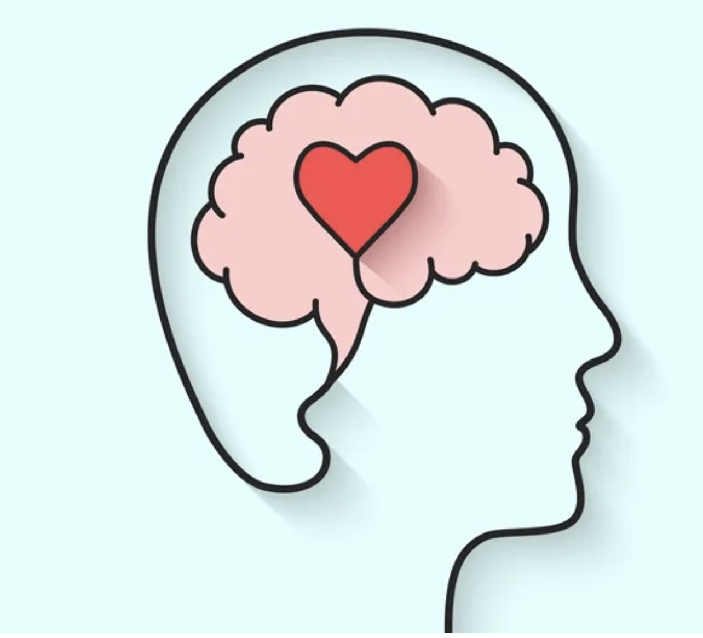

# 517-ravindran-mentalhealth
Practice Repo for 517

> "Its Okay to Not be Okay. We all have our problems."

# The Importance of Mental Health 

Society has normalised the stigmatistion of mental health conditions. It's high time we realised that there is nothing shameful about seeking help for mental conditions just as we do for physical health. This must be done with immediate action. 

## Seeking Help

As students of NC State, we can reach out to
[Campus Health](https://counseling.dasa.ncsu.edu/) and schedule appointments for councelling sessions . 

Students can also reacg out to [prevention services](https://prevention.dasa.ncsu.edu/) for additional help and guidance. 

## What We Must Do as a Community 

## Prevention of Crisis

## Conclusion 

